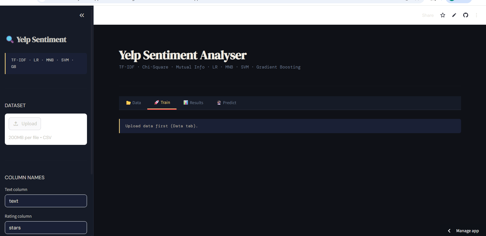

# 🔍 Yelp Sentiment Analyser

A Streamlit web app for sentiment analysis of Yelp reviews using TF-IDF features combined with handcrafted linguistic signals and four ML classifiers.

---

## Features

- **Four classifiers** trained and compared side-by-side: Logistic Regression, Multinomial Naive Bayes, Linear SVM, and Gradient Boosting
- **Rich feature set**: TF-IDF bigrams, lexicon scores, sentence length, average word length, punctuation density, and negation detection
- **Feature selection**: Chi-Square and Mutual Information rankings
- **Interactive results**: confusion matrices, per-class classification reports, top features per class
- **Live prediction**: single review analysis with word-level highlighting (positive, negative, negation words)
- **Batch prediction**: upload a CSV and download sentiment predictions

---

## Setup

### 1. Clone / download the project

```bash
git clone <your-repo-url>
cd <project-folder>
```

### 2. Create a virtual environment (recommended)

```bash
python -m venv venv
source venv/bin/activate        # macOS / Linux
venv\Scripts\activate           # Windows
```

### 3. Install dependencies

```bash
pip install -r requirements.txt
```

### 4. Run the app

```bash
streamlit run sentiment_app.py
```

The app opens automatically at `http://localhost:8501`.

---

## Dataset Format

Upload any CSV file with at least two columns:

| Column  | Description                        | Default name |
|---------|------------------------------------|--------------|
| `text`  | Raw review text                    | `text`       |
| `stars` | Numeric star rating (1 – 5)        | `stars`      |

Column names can be changed in the sidebar if yours differ.

**Label mapping applied internally:**

| Stars | Label    |
|-------|----------|
| 1 – 2 | Negative |
| 3     | Neutral  |
| 4 – 5 | Positive |

The [Yelp Open Dataset](https://www.yelp.com/dataset) (`yelp_academic_dataset_review.json`) is a good source. Convert it to CSV and select the `text` and `stars` columns before uploading.

---

## App Tabs

| Tab        | What it does                                                                 |
|------------|------------------------------------------------------------------------------|
| 📂 Data    | Preview the uploaded CSV, view star-rating distribution and missing values   |
| 🚀 Train   | Train all four models with an 80/20 stratified split                         |
| 📊 Results | Compare F1 scores, inspect confusion matrices and top features per model     |
| 🔮 Predict | Analyse a single review or run batch predictions on a new CSV                |

---

## Requirements

- Python 3.9 or later
- See `requirements.txt` for package versions

---

## Project Structure

```
.
├── sentiment_app.py   # Main Streamlit application
├── requirements.txt   # Python dependencies
└── README.md          # This file
```

---

## How It Works

1. **Preprocessing** — text is lowercased and non-alphabetic characters are stripped before TF-IDF vectorisation.
2. **Feature extraction** — TF-IDF bigrams (up to 5,000 features) are combined with six handcrafted features:
   - Negative and positive lexicon scores (with negation and intensifier context)
   - Sentence length (word count)
   - Average word length
   - Punctuation density
   - Presence of negation words
3. **Feature selection** — Chi-Square and Mutual Information scores rank the most informative TF-IDF tokens.
4. **Training** — all four classifiers are trained; the one with the highest macro F1 on the held-out test set is selected as the default predictor.
5. **Prediction** — the best model classifies new reviews; a lexicon bar chart and colour-coded word highlights accompany each prediction.
6. # Yelp Sentiment Analyser 📊
A machine learning application to classify Yelp reviews using NLP techniques.

[](PASTE_YOUR_URL_HERE)

---

## App Preview


---

## Project Structure)](PASTE_YOUR_URL_HERE)

---

## App Preview


---

 
